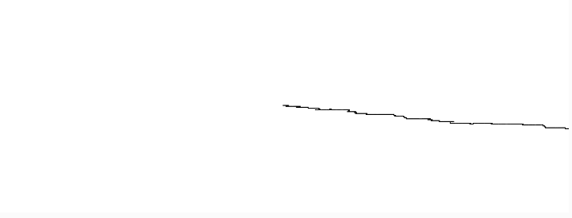

# Respuesta

## Explicación de la diferencia entre distribuciones uniformes y no uniformes

Las distribuciones uniformes arrojaran numeros al azar y en relacion al tiempo tienden a aplanarse a que todos los numeros salgan mas o menos cantidades de veces iguales
Sin embargo las distribuciones no uniformes tienden a ciertos valores, esto se puede ver reflejado con la campana de Gauss que nos muestra cuando existe cierta tendencia a un valor y este se muestra como un pico en la frecuencia en la que aparece.

```js
class Walker {
  // Objects have a constructor where they are initialized.
  constructor() {
    // Objects have data.
    this.x = width / 2;
    this.y = height / 2;
  }

  // Objects have methods.
  show() {
    stroke(0);
    point(this.x, this.y);
  }

  step() {
    //{!1} 0, 1, 2, or 3. The random choice determines the step.
    let choice = floor(randomGaussian(0));
    if (choice === 0) {
      this.x++;
    } else if (choice === 1) {
      this.x--;
    } else if (choice === 2) {
      this.y++;
    } else if (choice === 3) {
      this.y--;
    }

  }
}

//{!1} Remember how p5.js works? setup() is executed once when the sketch starts.
function setup() {
  createCanvas(640, 240);
  // Create the walker.
  walker = new Walker();
  background(255);
}

//{!1} Then draw() loops forever and ever (until you quit).
function draw() {
  // Call functions on the walker.
  walker.step();
  walker.show();
}
```

## Caputra de Pantalla del resultado del codigo


